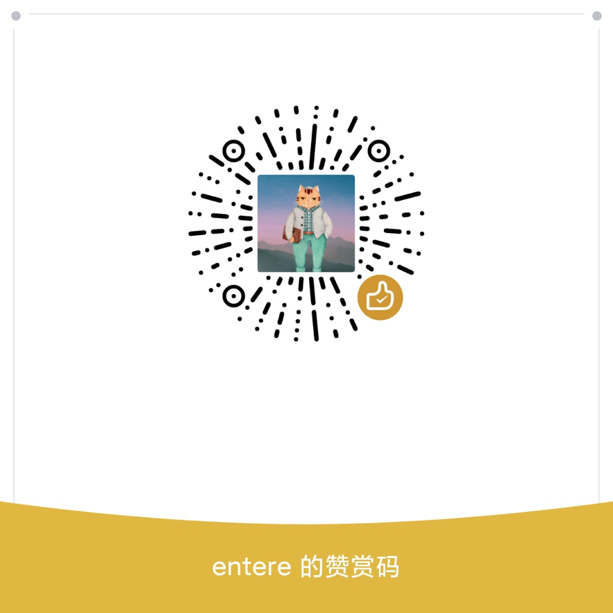

# poster
`poster` 是一个使用`golang`编写的生成二维码海报的组件，通过非常简单的配置就可以生成精美的海报。支持向海报上添加本地图片、添加远程（圆角）图片、添加二维码、添加文字。。

## 生成效果

可以直接下载组件，运行main.go查看海报生成效果 

```bash
git clone github.com/hitailang/poster 
go run main.go
```


## 使用方法

1、使用go get 命令安装组件

```bash
$ go get -u github.com/hitailang/poster

```
2、把准备好的海报底图、字体文件放到指定目录，这里放到了assets目录下面，同时新建一个海报输出目录，这里是build目录
3、新建一个go文件，比如main.go,引入poster库

```cgo
import (
	"fmt"
	"github.com/hitailang/poster/core"
	"github.com/hitailang/poster/handler"
	"github.com/rs/xid"
)

```
然后在方法中调用poster：


```cgo

    nullHandler := &handler.NullHandler{}
	ctx := &handler.Context{
		//图片都绘在这个PNG载体上
		PngCarrier: core.NewPNG(0, 0, 750, 1334),
	}
	//绘制背景图
	backgroundHandler := &handler.BackgroundHandler{
		X:    0, // 图片x坐标
		Y:    0, // 图片y坐标
		Path: "./assets/background.png", //图片路径
	}
	//绘制圆形图像
	imageCircleLocalHandler := &handler.ImageCircleLocalHandler{
		X:   30, // 图片x坐标
		Y:   50, // 图片y坐标
        Path: "./assets/reward.png",
		//URL: "http://thirdwx.qlogo.cn/mmopen/vi_32/Q0j4TwGTfTLJT9ncWLPov6rAzn4VCPSC4QoAvdangHRB1JgszqCvffggAysvzpm5MDb72Io4g9YAScHEw7xSWg/132", //图片路径
	}
	//绘制本地图像
	imageLocalHandler := &handler.ImageLocalHandler{
		X:    30, // 图片x坐标
		Y:    400,// 图片y坐标
		Path: "./assets/reward.png", //图片路径
	}

	//绘制二维码
	qrCodeHandler := &handler.QRCodeHandler{
		X:   30, // 二维码x坐标
		Y:   860,// 二维码y坐标
		URL: "https://github.com/hitailang/poster", // 二维码跳转URL地址
	}
	//绘制文字
	textHandler1 := &handler.TextHandler{
		Next:     handler.Next{},
		X:        180, // 文字x坐标
		Y:        105, // 文字y坐标
		Size:     20,  // 文字大小
		R:        255, // 文字颜色RGB值
		G:        241,
		B:        250,
		Text:     "如果觉得这个库对您有用", // 文字内容
		FontPath: "./assets/msyh.ttf",  // 字体文件
	}
	//绘制文字
	textHandler2 := &handler.TextHandler{
		Next:     handler.Next{},
		X:        180,
		Y:        150,
		Size:     22,
		R:        255,
		G:        241,
		B:        250,
		Text:     "请随意赞赏~~",
		FontPath: "./assets/msyh.ttf",
	}
	//结束绘制，把前面的内容合并成一张图片,输出到build目录
	endHandler := &handler.EndHandler{
		Output: "./build/poster_" + xid.New().String() + ".png",
	}

	// 链式调用绘制过程
	nullHandler.
		SetNext(backgroundHandler).
		SetNext(imageCircleLocalHandler).
		SetNext(textHandler1).
		SetNext(textHandler2).
		SetNext(imageLocalHandler).
		SetNext(qrCodeHandler).
		SetNext(endHandler)

	// 开始执行业务
	if err := nullHandler.Run(ctx); err != nil {
		// 异常
		fmt.Println("Fail | Error:" + err.Error())
		return
	}
	// 成功
	fmt.Println("Success")
	return

```


## 使用注意事项

* endHandler 要放到链式调用最后
* 图片需要是png格式

## 打赏

如果你觉得使用这个组件节约了你的时间，请扫码打赏^_^



